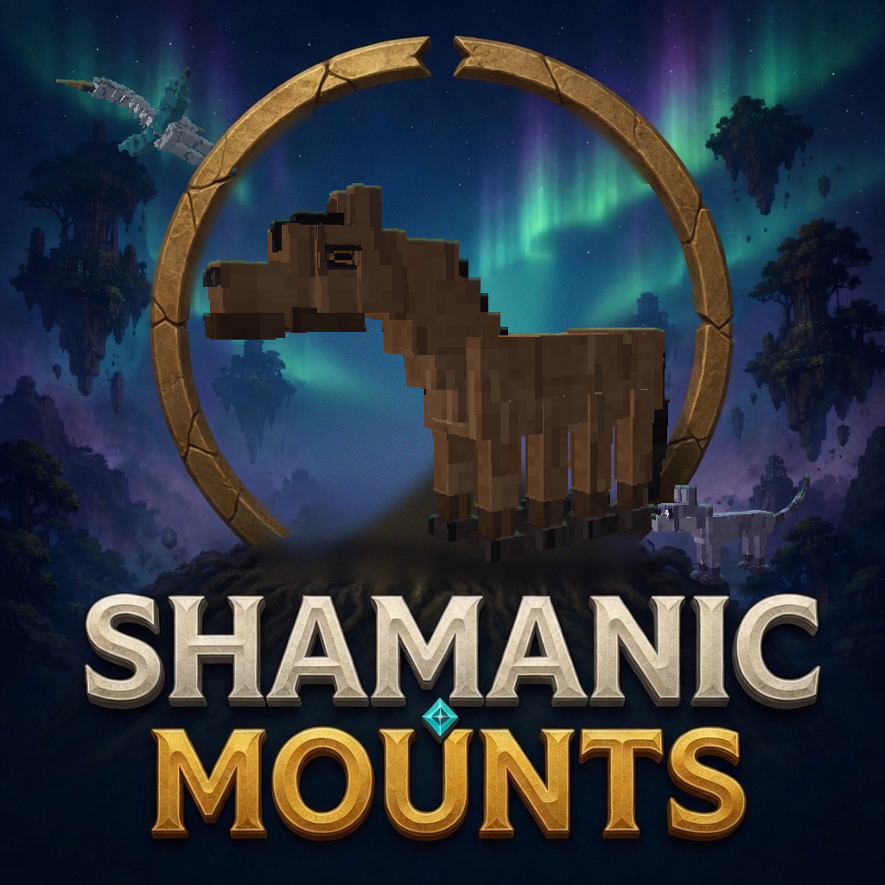

  

# Shamanic Mounts

Spirit mounts for **Minecraft 1.21.1 / NeoForge 21.1.249**. Ten founder lines. Any two can breed. The foal is one animal: the body, the feet, the wings, the tail, and the ridden abilities it inherited.

Source: https://github.com/AhmiDarrow/Shamanic-Mounts. The sanitize gate `python tools/gates/sanitize.py` runs before every push and upload.

The CurseForge page for the first send is [docs/public/store-description.md](docs/public/store-description.md). Upload notes are in [docs/curseforge.md](docs/curseforge.md). The project does not have a CurseForge id yet. The release gate is the live harness in [docs/harness.md](docs/harness.md): a real server and client that photograph every line, ride each one, fire every ability, and breed a chimera from the ten wild lines.

  

## The lines

- **Eightfold.** Eight hooves. Walks on water and steps up a full block while ridden.
- **Drum hart.** Drum use gives Regeneration II for 5 seconds to you, the hart, and players within 8 blocks (20 second cooldown). Night vision while mounted. Hunger at half speed.
- **Elk.** Its saddle bags hold three rows instead of two. Attack control rams, with strong knockback, on a 4 second cooldown. Larger than a horse.
- **Crane.** Two riders. Hold jump to glide. Hunger at half speed.
- **Nagual.** Use sends it away for 30 seconds. You get Speed II and Jump Boost II, and creepers ignore you. It returns beside you when the time ends or if you take damage. Cooldown 60 seconds. Both parents must pass it on.
- **Barghest.** Hostile mobs within 32 blocks glow through walls while you ride (48 if both parents passed the scent on). It sits when you dismount and attacks anything that hurts you.
- **Roc.** Hold jump to fly and climb for about 8 seconds, then glide until the bar refills. No fall damage while mounted. Both copies: the climb does not drain hunger. One copy: flight only at night. Larger than a horse.
- **Bear.** Attack control mauls everything in front for heavy damage and a slow, 3 second cooldown. Both copies: Resistance while you ride. Stands guard like the hound. Black, grizzly, and polar pelts.
- **Serpent.** No legs: an anaconda's body with a frilled snake's head. It swims fast and dives; hold jump to rise, hold sneak to sink, tap sneak to step off. Attack coils the nearest foe in front, holding and poisoning it for 3 seconds, 5 second cooldown. Both copies: you breathe under water while riding. River, jungle, and bone pelts.
- **Shade.** Hold sneak and mobs stop targeting you and the cat, until you hit something or break a block. Sneak and use blinks 6 blocks forward into open air, 3 second cooldown. Hide and blink each need both copies. Under light level 7, Speed I. On a mount that hides or blinks, a held sneak keeps you in the saddle; tap sneak to step off.

A mount that inherited more than one of the drum, the send-away, and the blink uses them in that order. The attack control coils if it has the coil, mauls if it has the might, and rams otherwise. Sneak and use blinks first, so the others stay reachable.

Everyone stands at least as tall as a horse. Every line comes in three pelts and five sizes, each its own gene.

Sneak and right-click a tame mount, or press your inventory key while riding, for the classic mount screen: the tack slots and the mount on the left, its bags on the right, and three choices under them. **Saddle Bags** are their own item, four leather around a chest, and strap on under the saddle for two rows of five slots. Taking them off tips out whatever they held. Vanilla horse armor, leather to diamond, buckles into the third slot with its usual protection and is worn over the whole barrel. **Follow** keeps up with you. **Stay** lies down where it was left. **Wander** roams nearby. A barghest stays on its own when you step off.

## Where they live

Each line spawns in its own biomes, and each biome favours one of its pelts: polar bears on snow and ice, grizzlies in taiga and mountains, black bears in forests; snow leopards on snowy slopes and panthers in bamboo jungle; red rocs and barghests in badlands. Cold biomes lean a size larger and hot ones a size smaller, and spawn eggs roll the same way.

Everything is a tag, built on the common `c:` biome tags so modded biomes pick the mounts up:

- `data/shamanicmounts/tags/worldgen/biome/spawns/<line>.json`: where a line spawns.
- `data/shamanicmounts/tags/worldgen/biome/pelts/<line>/<a|b|c>.json`: where each pelt is at home.
- `data/shamanicmounts/tags/worldgen/biome/size/larger.json` and `smaller.json`: the climate's size lean.
- `data/shamanicmounts/tags/block/spawnable_on.json`: the ground a wild mount spawns on.

`python tools/write_spawn_tags.py` regenerates them from one table.

## Tack and taming

Every mount needs a **Shamanic Saddle**. A vanilla saddle does not fit. Food does not tame.

The saddle is a gold ingot over leather, a saddle, and leather. Right-click a wild adult with it. The mount stays put. Four jolts: each winds up for three quarters of a second, and you hold jump as it ends. Four successes and it is tame. Miss, dismount, or hit the mount, and you keep the saddle. That mount refuses another try for 10 seconds.

## Breeding

Any line with any other. The breed item is a Diamond Apple: eight diamonds around an apple, the same shape as a golden apple. Feed one to a tame adult you own, then the other within ten seconds and eight blocks. One foal, one body. The foal is born wild, keeps near the grown mounts, and wears no saddle, bags, or armor until it is grown. Tame it then with the saddle like any wild adult, and its parents go in the herd book. Those two parents rest for five minutes. An operator can feed them during that rest, and a mount an operator readied stays ready until the pair is made. Every gene has two copies, one from each parent, and the herd book tracks both.

- **Body** shows by rank: bear, steed, hart, hound, cat, bird, serpent. The hidden body pulls the neck, head, tail, and girth halfway toward its own shape.
- **Head, feet, and tail** each show one copy, picked at birth. **Legs** meet in the middle; no legs is recessive.
- **Size** is XS to XL within the line, and the copies average. **Build** is the line's frame on top of it.
- **Pelt** is A over B over C; the third pelt of every line needs two copies.
- **Wingspan** averages its two copies, small x0.6 to vast x3.0.
- **Ridden gifts** stack on any body. Skin, veil, and the nagual's bond need both copies; one dream copy flies only at night.

Linked genes travel together: the body with legs, feet, and gait; the head with build, size, pattern, and pelt. A crossover splits neighbours about one time in eight.

When both parents already have every ability, the foal is an even chance of that normal cross, or the **chimera**: a furry dragon with scale plates, the eleventh form, carrying every ability. The bred body genes stay underneath the dragon.

The herd book keeps every gene, the parents, and the children, including mounts that are not loaded. Rename a tame or release it from the tames page. The breeding chapter hides behind a spoiler switch saved on your computer.

Code is MIT. Created by Ahmi Darrow.
