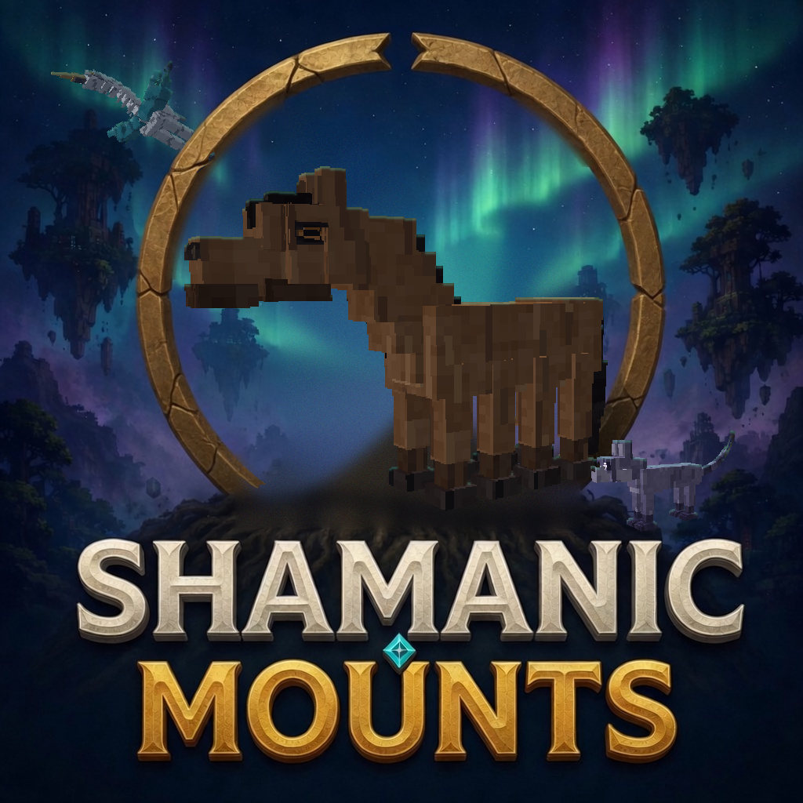
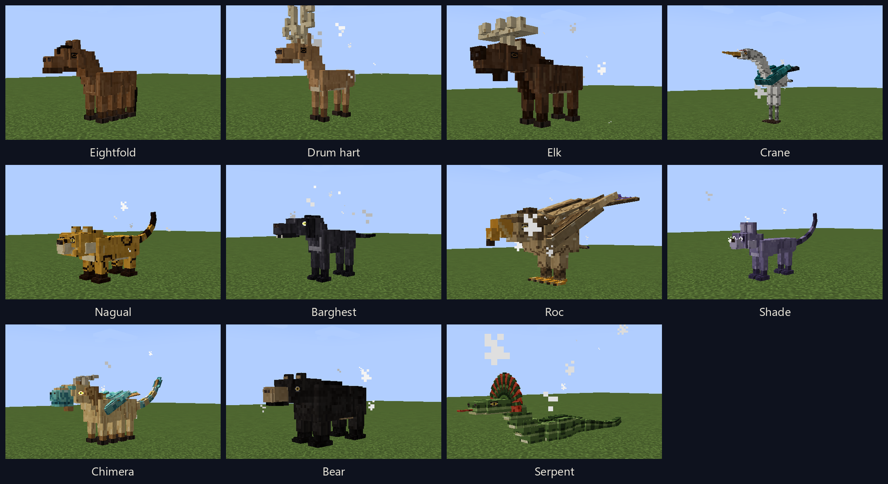

  

# Shamanic Mounts

Spirit mounts for **Minecraft 1.21.1 / NeoForge 21.1.249**. Version **0.1.10**. Ten new rideable lines roam the Overworld, each with something it does under you: walk on water, fly, swim and dive, ram, maul, coil, hide from mobs, blink ahead, or heal the party. Calm one with a golden apple, then tame it from the saddle, and breed any line with any other. The foal is one animal: the body, the feet, the wings, the tail, and the ridden abilities it inherited. Breed far enough and you reach the chimera, a furry dragon with all ten ridden gifts at once.

[Download from GitHub Releases](https://github.com/AhmiDarrow/Shamanic-Mounts/releases/latest) · [CurseForge](https://www.curseforge.com/minecraft/mc-mods/shamanic-mounts) · [0.1.10 notes](docs/RELEASE_0.1.10.md)

  

## The lines

- **Eightfold.** Eight hooves. Walks on water and steps up a full block while ridden.
- **Drum hart.** Drum use gives Regeneration II for 5 seconds to you, the hart, and players within 8 blocks (20 second cooldown). Night vision while mounted. Hunger at half speed.
- **Elk.** Its saddle bags hold three rows instead of two. Attack control rams, with strong knockback, on a 4 second cooldown. Larger than a horse.
- **Crane.** Two riders. Hold jump to glide. Hunger at half speed.
- **Nagual.** Use sends it away for 30 seconds. You get Speed II and Jump Boost II, and creepers ignore you. It returns beside you when the time ends or if you take damage. Cooldown 60 seconds. Both parents must pass it on.
- **Barghest.** Hostile mobs within 32 blocks glow through walls while you ride (48 if both parents passed the scent on). It guards: told to stay, it still gets up to fight back.
- **Roc.** Hold jump to fly and climb for about 8 seconds, then glide on condor wings until the bar refills. No fall damage while mounted. Both copies: the climb does not drain hunger. One copy: flight only at night. Larger than a horse.
- **Bear.** Attack control mauls everything in front for heavy damage and a slow, 3 second cooldown. Both copies: Resistance while you ride. Guards like the hound. Black, grizzly, and polar pelts.
- **Serpent.** No legs: an anaconda's body with a frilled snake's head. It swims fast and dives; hold jump to rise, hold sneak to sink, tap sneak to step off. Attack coils the nearest foe in front, holding and poisoning it for 3 seconds, 5 second cooldown. Both copies: you breathe under water while riding. River, jungle, and bone pelts.
- **Shade.** Hold sneak and mobs stop targeting you and the cat, until you hit something or break a block. Sneak and use blinks 6 blocks forward into open air, 3 second cooldown. Hide and blink each need both copies. Under light level 7, Speed I. On a mount that hides or blinks, a held sneak keeps you in the saddle; tap sneak to step off.

A mount that inherited more than one of the drum, the send-away, and the blink uses them in that order. The attack control coils if it has the coil, mauls if it has the might, and rams otherwise. Sneak and use blinks first, so the others stay reachable. Tame mounts are one herd: the ram, maul, and coil pass over them, and they never fight each other.

Everyone stands at least as tall as a horse. Every line comes in three pelts and five sizes, each its own gene.

Sneak and right-click a tame mount, or press your inventory key while riding, for the classic mount screen: the tack slots and the mount on the left, its bags on the right, and three choices under them. **Saddle Bags** are their own item, four leather around a chest, and strap on under the saddle for two rows of five slots. Taking them off tips out whatever they held. Vanilla horse armor, leather to diamond, buckles into the third slot with its usual protection and is worn over the whole barrel. A new tame is on **Follow**: it keeps up with you, keeps following when you step off, and teleports to safe ground beside you when you get more than 12 blocks ahead. **Stay** lies down where it was left, and again wherever you step off it, until you choose another order. **Wander** roams nearby. Each choice is confirmed above the hotbar.

Following mounts go with you into other dimensions. When you leave by a portal, a command, the way home from the End, or another mod's teleport, every following mount of yours within 24 blocks comes too, up to eight, nearest first, and is set down beside you on solid ground, out of water, lava, fire, and leaves. If you were riding one, you arrive in the saddle. Mounts on stay or wander, leashed mounts, mounts carrying another rider, and mounts in chunks that are not loaded stay where they are, and a mount that finds no room beside you stays behind and says so.

Mounts saved by 0.1.5 or earlier that were on wander, the order every tame used to get, load on follow, and so do guarding mounts that were sitting, since stepping off used to sit them. Any other mount told to stay keeps staying.

## Where they live

Each line spawns in its own biomes, and each biome favours one of its pelts: polar bears on snow and ice, grizzlies in taiga and mountains, black bears in forests; snow leopards on snowy slopes and panthers in bamboo jungle; red rocs and barghests in badlands. Cold biomes lean a size larger and hot ones a size smaller, and spawn eggs roll the same way.

Everything is a tag, built on the common `c:` biome tags so modded biomes pick the mounts up:

- `data/shamanicmounts/tags/worldgen/biome/spawns/<line>.json`: where a line spawns.
- `data/shamanicmounts/tags/worldgen/biome/pelts/<line>/<a|b|c>.json`: where each pelt is at home.
- `data/shamanicmounts/tags/worldgen/biome/size/larger.json` and `smaller.json`: the climate's size lean.
- `data/shamanicmounts/tags/block/spawnable_on.json`: the ground a wild mount spawns on.

`python tools/write_spawn_tags.py` regenerates them from one table. With [Tribal Power](https://www.curseforge.com/minecraft/mc-mods/tribalpower) installed, every line also lives in the March biomes that suit it, with its home pelt; without it those rules do nothing.

## Tack and taming

Every mount needs a **Shamanic Saddle**. A vanilla saddle does not fit. Food does not tame.

Wild adults attack. A golden apple makes one stop for two minutes. While it is calm, right-click with the saddle to put it on. The saddle is a gold ingot over leather, a saddle, and leather. Right-click again to mount. For thirty seconds the mount shows a direction. Press that direction with the movement keys or the arrow keys. The mount steps the other way. Fifteen prompts, two seconds each. Four misses are allowed. Getting off fails the try, you keep the saddle, and that mount refuses another try for 10 seconds. A hit does not.

The **Mount Flute**, a gold ingot over a stick over leather, calls up to eight of your tame mounts to your side from any distance and any dimension, and they arrive on follow. Mounts in a rein trial, on a leash, or carrying another rider stay put. The **Mount Trading Post**: ride a tame up and use it to offer that mount; another rider who uses a post on their own mount swaps with you. Sneak as you use it to offer a gift that a player on foot can take. The herd book entry and pedigree go with the mount.

**Bred stats.** Health, Speed, Jump and Stamina run from 1 to 100 and show in the herd book. Wild mounts roll 28 to 48; a foal takes mostly after the stronger parent and now and then comes out a step higher. Hold sprint while riding to gallop for as long as stamina lasts, 2 to 12 seconds.

## Breeding

Any line with any other. The breed item is a Diamond Apple: eight diamonds around an apple, the same shape as a golden apple. Feed one to a tame adult you own, then the other within ten seconds and eight blocks. One foal, one body. The foal is born wild, keeps near the grown mounts, and wears no saddle, bags, or armor until it is grown. Once grown, calm it with a golden apple and tame it from the saddle, and its parents go in the herd book. Those two parents rest for five minutes. An operator can feed them during that rest, and a mount an operator readied stays ready until the pair is made. Every gene has two copies, one from each parent, and the herd book tracks both.

- **Body** shows by rank: bear, steed, hart, hound, cat, bird, serpent. The hidden body pulls the neck, head, tail, and girth halfway toward its own shape.
- **Head, feet, and tail** each show one copy, picked at birth. **Legs** meet in the middle; no legs is recessive.
- **Size** is XS to XL within the line, and the copies average. **Build** is the line's frame on top of it.
- **Pelt** is A over B over C; the third pelt of every line needs two copies.
- **Wingspan** averages its two copies, small x0.6 to vast x3.0.
- **Ridden gifts** stack on any body. Skin, veil, and the nagual's bond need both copies; one dream copy flies only at night.

Linked genes travel together: the body with legs, feet, and gait; the head with build, size, pattern, and pelt. A crossover splits neighbours about one time in eight.

When both parents already have every ridden gift, the foal is an even chance of that normal cross, or the **chimera**: a furry dragon with scale plates, the eleventh form, carrying all ten gifts. Hiding, gliding, and guarding are not gifts (they come from the ghost phase, full wings, and the guard ward), so the chimera has them only if the bred body genes underneath do.

The herd book keeps every gene, the parents, and the children, including mounts that are not loaded. Rename a tame or release it from the tames page. Every chapter is open; the chimera joins the book once you breed one.

## Requirements

| | |
|---|---|
| **Minecraft** | 1.21.1 |
| **Loader** | NeoForge **21.1.249** |
| **Java** | 21 |
| **Side** | Client + Server |

No other mods required.

## Build

Java 21. `./gradlew test`, then `./gradlew build`; the jar is `build/libs/shamanicmounts-<version>.jar`. The release gate is the live harness in [docs/harness.md](docs/harness.md): a real server and client that photograph every line, ride each one, fire every ability, and breed a chimera from the ten wild lines. `python tools/gates/sanitize.py` runs before every push and upload. The store page text is [docs/public/store-description.md](docs/public/store-description.md); upload notes are in [docs/curseforge.md](docs/curseforge.md).

Code is MIT. Created by Ahmi Darrow.
