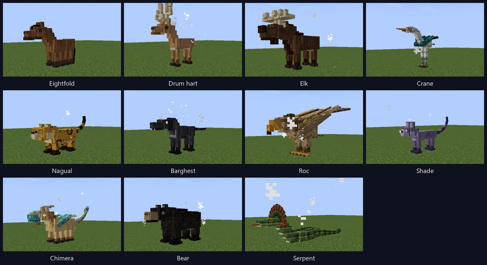

# Shamanic Mounts — The Spirit Herd

**CurseForge summary (one line):** Ten spirit mounts, from eight-legged steeds and drum harts to rocs, bears and a frilled serpent. Tame with a braced saddle, breed any two, and chase the chimera.

Spirit mounts for Minecraft 1.21.1, NeoForge 21.1.249, and Java 21. Ten founder lines roam the Overworld, each in its own biomes and in the pelt at home there, each with a body, a gait and something it does when ridden. Brace a wild one to tame it, then breed any line with any other. The foal is one animal built from two copies of every gene: body, head, legs, tail, size, pelt, wings and ridden gifts, all tracked in a herd book that writes them the way a breeder would.

https://github.com/AhmiDarrow/Shamanic-Mounts

## Ten lines

Every line comes in three pelts and five sizes, each set by its own gene.

**Eightfold.** Eight hooves in four pairs. While you ride it, it walks on water and steps up a full block. Bay, black and palomino.

**Drum hart.** Use the drum: Regeneration II for 5 seconds on you, the hart and players within 8 blocks, on a 20 second cooldown. Night vision while mounted, and hunger drains at half speed. Tan, red and white.

**Elk.** Its saddle bags hold three rows instead of two. The attack control is a ram: a short lunge, a little damage and strong knockback, on a 4 second cooldown. Larger than a horse, with more health. Dark, brown and grey.

**Crane.** Two riders, like a camel. Hold jump to glide. It falls slowly and does not climb, and hunger drains at half speed. White, grey and black.

**Nagual.** Use sends it away for 30 seconds. You get Speed II and Jump Boost II, and creepers do not target you. It comes back beside you when the time ends, or at once if you take damage. Cooldown 60 seconds. Gold, a green-eyed black panther, and a golden-eyed snow leopard.

**Barghest.** While you ride it, hostile mobs within 32 blocks glow through walls, or 48 from both parents. Step off and it stays, then goes for anything that hurts you. Black, grey and red.

**Roc.** Hold jump to fly and gain height: about 8 seconds of climb, then it glides until the bar refills. No fall damage while mounted. From both parents the climb does not drain hunger; from one, it flies only at night. Larger than a horse. Bone, storm and red.

**Bear.** The attack control is a maul: a heavy swipe at everything in front, with a slow, on a 3 second cooldown. From both parents you take less damage while riding. It stands guard when you step off. Black bear, grizzly and polar.

**Serpent.** No legs: an anaconda's body and a snake's head ringed by a frilled lizard's collar. It swims fast and dives. Hold jump to rise, hold sneak to sink, tap sneak to step off. The attack control coils the nearest foe in front, holding and poisoning it for 3 seconds, on a 5 second cooldown. From both parents you breathe under water while riding. River, jungle and bone.

**Shade.** Hold sneak while riding and mobs stop targeting you and the cat, until you hit something or break a block. Sneak and use blinks 6 blocks forward into open air, on a 3 second cooldown. Under light level 7 it has Speed I. Dusk, silver and ink.

On a mount that hides, blinks or dives, a held sneak keeps you in the saddle and a tap steps you off. A mount that inherited more than one of the drum, the send-away and the blink uses them in that order. Everyone stands at least as tall as a horse; the elk and the roc are the big ones.

## Where they live

Each line spawns in its own biomes, and each biome favours one of its pelts.

| Line | Lives in | Pelts and where they are at home |
|---|---|---|
| Eightfold | plains, meadows, savanna, windswept hills | bay on the plains, black on windswept hills, palomino in savanna |
| Drum hart | forests, cherry groves, snowy plains | tan in forests, red among flowers, white in the snow |
| Elk | taiga, groves, snowy plains | dark in taiga, brown in old growth, grey in the snow |
| Crane | swamps, rivers, beaches | white on swamps and rivers, grey on beaches and shores, black in the cold |
| Nagual | jungles, snowy slopes | gold in jungle, black panther in bamboo jungle, snow leopard on snowy slopes |
| Barghest | dark forests, windswept hills, badlands | black in dark woods, grey on windswept hills, red in badlands |
| Roc | mountains, hills, badlands | bone on mountains, storm on windswept hills, red in badlands |
| Shade | dark forests, mushroom fields, snowy taiga | dusk in dark woods, silver in the snow, ink on mushroom fields |
| Bear | forests, taiga, snow and ice | black bear in forests, grizzly in taiga and mountains, polar bear on snow and ice |
| Serpent | swamps, jungles, rivers, deserts | river on rivers and swamps, jungle in jungles, bone in deserts |

Cold biomes lean a size larger and hot ones a size smaller. Spawn eggs hatch the pelt and size the biome they are used in would give.

Every one of these is a biome tag built on the common `c:` tags, so modded biomes tagged as forest, taiga, snowy, jungle and the rest get the right mounts on their own, and a datapack can add any biome to `shamanicmounts:spawns/<line>` or `shamanicmounts:pelts/<line>/<a|b|c>`.

## Brace to tame

Food does not tame a spirit mount. Craft a Shamanic Saddle, a gold ingot over leather, a saddle and leather, and right-click a wild adult with it. The saddle goes on and the mount stands still. Four jolts follow. Each winds up for three quarters of a second, and you must be holding jump as it ends. Four held jumps and it is yours. Miss, get off or hit the mount and the try fails; you keep the saddle, and that mount refuses another try for 10 seconds. A vanilla saddle does not fit.

## Tack and orders

Sneak and right-click a tame mount, or press your inventory key while riding, for the classic mount screen: the tack and the mount on the left, its bags on the right, three orders underneath.

- **Saddle Bags** are their own item, four leather around a chest. They strap on under the saddle for two rows of five, or three on an elk. Taking them off tips out what they held.
- **Horse armor**, leather to diamond, buckles into the third slot with its usual protection and is worn over the whole barrel.
- **Follow** keeps up with you, **Stay** lies down where you left it, and **Wander** roams nearby.

## Breeding and the chimera

Any line with any other. The breed item is a Diamond Apple, eight diamonds around an apple. Feed one to a tame adult you own, then the other within ten seconds and eight blocks. One foal is born and the parents rest for five minutes. An operator can feed them through that rest.

The foal is born wild. It keeps near the grown mounts of its kind and wears no saddle, bags or armor until it is grown. Then it takes the saddle like any wild adult, and its parents go into your herd book.

Breed until two mounts carry every gift, then breed those two. Each foal is an even chance of the same cross or the chimera: a furry dragon with scale plates down its back and sides and every gift at once. The body genes of the cross stay underneath it.

## Genes

Every mount carries two copies of every gene, one from each parent, and the herd book tracks them all.

- **Body** shows by rank: bear over steed over hart over hound over cat over bird over serpent. The hidden body still pulls the neck, head, tail and girth halfway toward its own shape, so a steed carrying serpent grows a longer neck and tail.
- **Head, feet and tail** each show one copy, picked at birth, so a bird's head can stand on hooves. The other copy is carried and can come back in a foal.
- **Legs** meet in the middle: eight with four shows the spare pair. No legs is recessive.
- **Size** runs XS, S, M, L, XL within every line, and the two copies average. Build is the line's frame on top of it, which is why the elk, the roc and the bear stand tallest. Bigger mounts have a little more health.
- **Pelt** is A over B over C. The third pelt of every line, palomino, white, snow leopard, polar and the rest, needs two copies.
- **Wingspan** runs from small to vast and the two copies average. A roc carries a vast copy, so bred fliers can grow wings two or three times a crane's.
- **Ridden gifts** are each their own gene and stack on whatever body the cross made. The shade's hide and blink and the nagual's send-away need both copies; one dream copy flies only at night; the rest show from one.

Genes that sit together usually travel together: the body with its legs, feet and gait; the head with build, size, pattern and pelt. About one time in eight a neighbour swaps over.

## The herd book

A readable book of the mounts you own, loaded or not. Each tame's page has its portrait, a summary of its body, pelt, size and sex, links to its dam, sire and foals, and every gene grouped by body, size, coat, wings, nature and gifts, with the dam's and sire's copies side by side. Genes are written in breeder's notation, a capital for the copy that shows and lowercase for the one it hides, and hovering a gene explains how it passes down. The Lines page opens each founder onto its three pelts and its genes, and the Key page lists every gene with its rule. Rename a tame or release it from its page. The breeding chapter hides behind a spoiler switch that stays the way you left it.

## Start your ride

Find a wild mount in its home biomes: bears in the woods and the snow, cranes on the rivers, rocs in the mountains. Craft a Shamanic Saddle and brace it to tame. Sneak and right-click it to strap on bags, then open the herd book. Everything the mod adds sits in its own creative tab.

## Requirements

| | |
|---|---|
| **Minecraft** | 1.21.1 |
| **Loader** | NeoForge **21.1.249** |
| **Java** | 21 |
| **Side** | Client + Server |

## With other mods

None needed. Shamanic Mounts is written to sit beside [Chocobos Reborn](https://www.curseforge.com/minecraft/mc-mods/chocobos-reborn) and [Tribal Power](https://www.curseforge.com/minecraft/mc-mods/tribalpower): the chocobos stay the pad-runners, and these are the other mounts. It is built on the same Minecraft and NeoForge as [Ninjacat Skies](https://www.curseforge.com/minecraft/modpacks/ninjacat-skies).

Version 0.1.0. Created by Ahmi Darrow. MIT. [Source and documentation](https://github.com/AhmiDarrow/Shamanic-Mounts).
